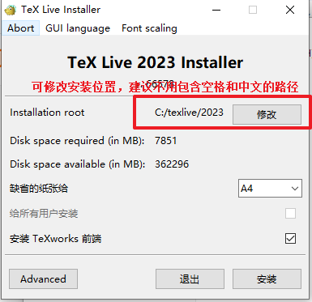
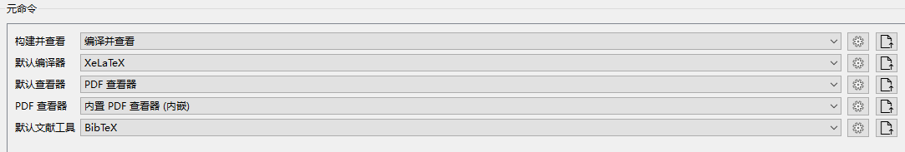
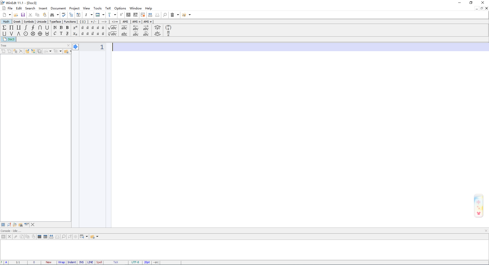

# LaTex教程

## 一、LaTex简介

LaTeX是一种基于ΤΕΧ的排版系统，对于生成复杂表格和数学公式，这一点表现得尤为突出。因此它非常适用于生成高印刷质量的科技和数学类文档。

## 二、准备工作

### 1. 下载Tex Live

可在清华大学开源镜像站下载。网址如下：https://mirrors.tuna.tsinghua.edu.cn/CTAN/systems/texlive/Images/

也可在阿里云开源镜像站下载。网址如下：https://mirrors.aliyun.com/CTAN/systems/texlive/Images/?spm=a2c6h.25603864.0.0.75936a4ep4zDuy

### 2. 安装Tex Live

双击下载好的texlive.iso文件，再双击install-tl-windows.bat文件，弹出一个黑色框，再弹出安装页面如下

然后点击安装即可，这个安装过程需要比较长的时间，耐心等待。

### 3. 安装编辑器

编辑器可选多个，有texstudio，winedit，vscode等。这里主要介绍前两种

TexStudio下载地址：https://texstudio.sourceforge.net/ . 本软件是开源免费软件，下载完成后，点击安装即可

若文档中包含中文，最好选择XeLatex编译方法，如下图所示

winedit软件下载地址：https://www.winedt.com/download.html

此软件为付费软件，最新版配套了相对应的PDF查看器，可自行查找破解办法或直接购买正版，界面如下

本软件全部为英文，无中文，慎选
