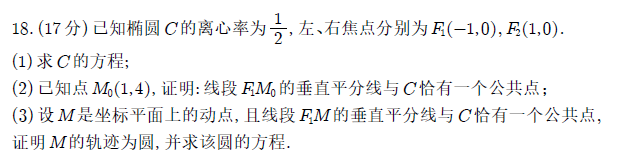
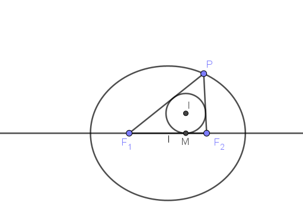

# 圆锥曲线的重要结论

## 一、光学性质

### 1. 椭圆

从其中一个焦点发出的光线经椭圆反射后会经过另一个焦点

例题：2025年1月3日八省联考试题

#### 1.1 椭圆光学性质的证明

##### 1.1.1 椭圆焦点三角形及其性质

### 2. 双曲线

从其中一个焦点发出的光线经双曲线反射后的光线反向延长线经过另一个焦点

### 3. 抛物线

从焦点发出的光线经抛物线反射后的光线平行于抛物线的对称轴